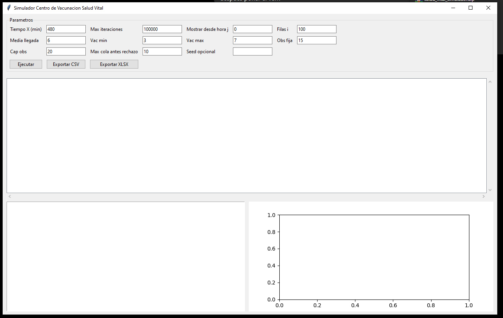
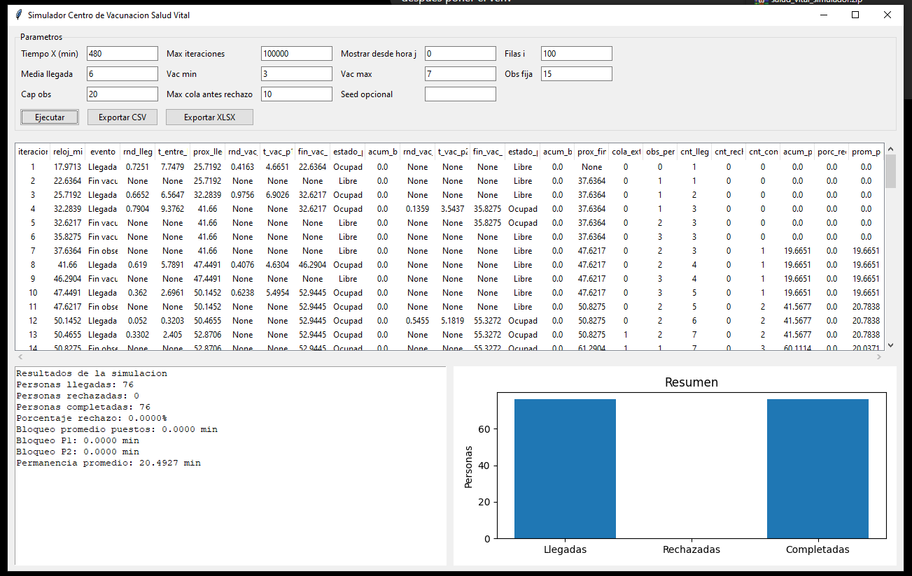

# Simulador Centro de Vacunacion Salud Vital

Proyecto Python ejecutable en PC de escritorio.

## Instalacion

```bash
python -m venv .venv
.venv\Scripts\activate
pip install -r requirements.txt
python main.py
```

En Linux/macOS:

```bash
python -m venv .venv
source .venv/bin/activate
pip install -r requirements.txt
python main.py
```

## Tecnologias
- python
- pandas==2.2.3
- openpyxl==3.1.5
- matplotlib==3.9.2

## Estructura

- `main.py`: punto de entrada.
- `salud_vital/domain.py`: objetos del sistema: persona, puesto, evento y estadisticas.
- `salud_vital/random_variables.py`: variables aleatorias del modelo.
- `salud_vital/simulator.py`: motor de simulacion.
- `salud_vital/gui.py`: interfaz de escritorio con tabla y grafico.
- `salud_vital/exporter.py`: exporta el vector visible a CSV o Excel.
- `salud_vital/config.py`: parametros.
- `salud_vital/interfaces.py`: contratos base.

## Memoria

El simulador no guarda las 100000 filas completas. Solo mantiene:

- fila actual;
- fila anterior;
- filas visibles pedidas por parametros;
- objetos que siguen vivos en el sistema: cola, puestos y observacion.

Al finalizar, limpia cola, eventos y objetos temporales.

## Pantallas



